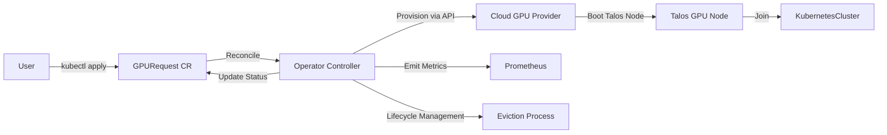
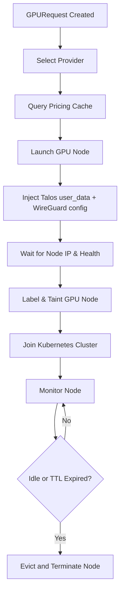
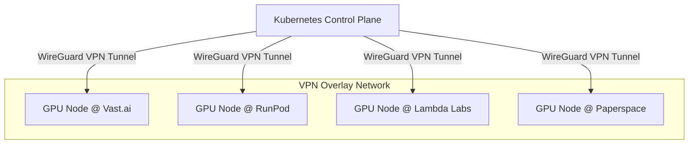

# tgp-operator — Design Document

**Date:** July 13, 2025  
**Status:** Approved  
**Version:** 2.0

## Introduction

`tgp-operator` is a Kubernetes-native operator designed to enable ephemeral, cost-efficient GPU provisioning for Talos Linux clusters across multiple affordable cloud providers. It targets users ranging from homelabs to startups and small businesses who require flexible GPU capacity for bursty workloads.

Dedicated GPUs incur significant capital and operational costs, while GPU workloads are often intermittent, leading to low hardware utilization. Public cloud GPUs offer convenience but tend to be costlier compared to marketplace providers such as Vast.ai and RunPod.

Talos Linux’s Kubernetes-first design emphasizes immutable, API-driven infrastructure, necessitating seamless integration with ephemeral GPU nodes. This operator leverages native cloud provider APIs and Talos bootstrapping to dynamically provision, manage, and evict GPU nodes as Kubernetes resources, reducing total cost of ownership and supporting cloud-native observability.

---

## Context and Problem Statement

Talos clusters are commonly deployed in hybrid or on-premise environments where owning GPUs is costly or impractical. Users face several challenges:

- High upfront and operational costs for dedicated GPUs  
- Inefficient utilization caused by intermittent GPU workloads  
- Lack of unified, Kubernetes-native tooling to provision ephemeral GPUs across diverse providers  
- Complex networking requirements to securely connect ephemeral GPU nodes—hosted across public clouds or marketplaces—to on-premise Talos control planes  
- Need for secure, scalable lifecycle management for GPU nodes within Kubernetes  

These factors impede flexible GPU resource usage and increase operational overhead, motivating an integrated solution that addresses ephemeral provisioning, secure hybrid networking, and Kubernetes lifecycle management.

---

## Economic Rationale

Owning GPUs like the NVIDIA RTX 3090 involves upfront hardware costs (~800 USD (converted from ~1,200 AUD)) and continuous power consumption (~250W). Marketplace GPU instances range from $0.35 to $0.45 USD per hour on spot or on-demand pricing.

Break-even usage for hardware costs occurs between approximately 1,800 to 2,300 hours of continuous operation. For typical intermittent usage patterns (e.g., 1 hour per day), cost amortization spans multiple years, making ephemeral provisioning economically favorable despite startup latency.

| Job Duration | Jobs to Break Even | Total GPU Hours |
|--------------|--------------------|-----------------|
| 1 hour       | 1,800 – 2,300      | 1,800 – 2,300   |
| 10 hours     | 180 – 230          | 1,800 – 2,300   |
| 50 hours     | 36 – 46            | 1,800 – 2,300   |

---

## Goals

- Provide multi-cloud GPU provisioning across Vast.ai, RunPod, Lambda Labs, and Paperspace  
- Optimize cost by selecting GPU instances based on price, region, and model  
- Manage GPU node lifecycle: provisioning, Talos bootstrapping, cluster join, eviction, and cleanup  
- Securely manage cloud provider credentials via Kubernetes Secrets  
- Emit Prometheus metrics for observability and cost tracking  
- Enable scale-to-zero support for ephemeral GPU workloads  

---

## Architecture Overview



The operator watches GPURequest custom resources to reconcile GPU node states. It interacts with cloud provider APIs to launch and terminate instances. Talos nodes boot with injected WireGuard configuration, securely joining the cluster.

---

## Provider Interface Design

Each cloud provider exposes APIs for:

- Instance lifecycle management (launch, terminate)  
- Instance status retrieval  
- Pricing and offer discovery  

The operator defines a provider client interface:

```go
type ProviderClient interface {
  LaunchInstance(spec GPURequestSpec) (GPUInstance, error)
  TerminateInstance(id string) error
  GetInstanceStatus(id string) (InstanceStatus, error)
  GetPricing(gpuType, region string) (float64, error)
  ListOffers(gpuType, region string) ([]GPUOffer, error)
}
```

| Provider    | API Type | Talos Boot Method           | Spot Support      |
|-------------|----------|----------------------------|-------------------|
| Vast.ai     | REST     | `user_data` or volume mount| Bid-based Spot    |
| RunPod      | REST     | `cloud_init`               | Spot & On-Demand  |
| Lambda Labs | REST     | `user_data`                | On-Demand Only    |
| Paperspace  | REST     | `user_data`                | On-Demand Only    |

Provider clients are modular, enabling extensibility and isolation of cloud-specific logic.

---

## Provisioning Flow



Steps:

1. User creates a GPURequest resource.  
2. Operator selects an optimal provider based on cached pricing.  
3. Operator launches GPU instance with Talos user data and WireGuard config.  
4. Node boots, establishes VPN tunnel, and joins cluster.  
5. Node is labeled and tainted to control scheduling.  
6. Operator monitors node health and usage.  
7. On idle timeout or TTL expiration, operator evicts and terminates node.

---

## GPU Node Lifecycle Management

- Talos nodes boot with immutable config, including WireGuard for secure cluster connectivity.  
- Nodes are labeled and tainted (e.g., `tgp.io/ephemeral: NoSchedule`) for workload targeting.  
- Eviction triggers include idle detection, TTL expiry, or manual intervention.  
- Metrics track GPU usage, cost, and node state over time.

---

## Pricing Cache

The operator maintains an internal pricing cache:

- Periodically polls providers for GPU offers.  
- Normalizes GPU metadata: model, memory, region, price.  
- Caches offers in memory or CRDs for fast lookup.  
- Emits Prometheus metrics on cache health and latency.  
- Enables cost-based provisioning decisions and potential dashboard integration.

---

## Networking: WireGuard Overlay



WireGuard establishes encrypted tunnels between the on-premise Talos control plane and ephemeral GPU nodes running remotely. VPN configs are injected during Talos node bootstrap, ensuring secure and seamless Kubernetes API access.

---

## Testing and Delivery

- Unit tests use provider API mocks to validate reconciliation logic.  
- Integration and end-to-end tests run on KinD or K3s clusters.  
- Operator and CRDs are packaged with Helm charts and published as OCI images.  
- Exploration of CUE for Helm chart generation and schema validation is planned.

---

## User Requirements

- Kubernetes v1.25+ cluster running Talos Linux nodes.  
- NVIDIA GPUs with drivers and NVIDIA GPU Operator installed on provisioned nodes.  
- WireGuard VPN server accessible to all ephemeral GPU nodes.  
- Cloud provider API credentials stored securely as Kubernetes Secrets.

---

## Design Justification and Inspirations

This operator is inspired by the Kubernetes Cluster Autoscaler, focusing on ephemeral node lifecycle management rather than enterprise-scale autoscaling. It embraces Kubernetes-native principles—CRDs, controllers, declarative management—and Talos immutable infrastructure.

The modular provider client interface isolates cloud-specific API logic, simplifying maintenance and extensibility.

Caching provider pricing and offers reduces API load and improves provisioning responsiveness, drawing from best practices in service discovery and caching.

Secure hybrid networking via WireGuard overlays enables hybrid cloud and on-prem environments to communicate securely, consistent with zero-trust network principles.

---

## Tradeoffs and Considerations

- **Cold start latency:** Ephemeral provisioning adds boot and initialization delays, unsuitable for latency-sensitive or very short jobs.  
- **Operational complexity:** Managing GPU nodes as Kubernetes resources adds abstraction layers that can increase troubleshooting difficulty.  
- **Debugging challenges:** Ephemeral nodes with dynamic lifecycles may complicate debugging compared to static GPU clusters.  
- **Resource fragmentation:** Multi-provider and ephemeral architectures can fragment workloads, introducing networking overhead and complexity.  
- **Use case suitability:** Best for intermittent, bursty workloads emphasizing cost efficiency. Long-running, SLA-critical, or highly interactive workloads may benefit from dedicated clusters or managed cloud services.

Users should evaluate their workload patterns, cost targets, and operational constraints to select appropriate GPU provisioning strategies.

---

# End of Document
